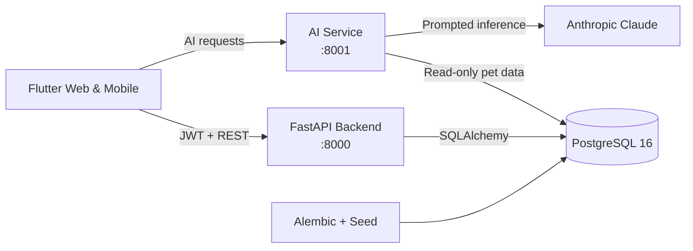

<div align="center">

# 🐾 PetAdopt

### AI-powered pet adoption across web and mobile

PetAdopt turns the classic Swagger Petstore into a complete adoption platform
with real listings, role-based workflows, admin moderation and AI-assisted pet
matching.

[](https://github.com/bilgenurpala/pet-adopt/actions/workflows/ci.yml)


[Features](#-features) · [Architecture](#-architecture) · [Quick Start](#-quick-start) · [API](#-api-and-permissions) · [Testing](#-testing-and-quality) · [Project Board](https://github.com/users/bilgenurpala/projects/8/views/1)

</div>

---

## ✨ Features

| Experience | Capabilities |
|---|---|
| **Adopters** | Register and sign in, browse approved pets, search and filter, manage favourites and track adoption applications |
| **Pet owners** | Create listings, upload photos and manage their own pets while approval rules protect public visibility |
| **Administrators** | Review pending listings, manage application status, control user roles and monitor platform statistics |
| **AI assistant** | Generate listing descriptions, recommend real adoptable pets, classify pet images and answer conversational requests |
| **Platform** | JWT authentication, RFC 7807 errors, pagination, OpenAPI 3.1, Docker Compose, seeded data and automated QA |

### Why this is more than a Petstore clone

The original Petstore shop model was redesigned around adoption. Prices became
optional adoption fees, orders became adoption applications, and user-created
listings now pass through an admin approval workflow. AI recommendations use
real, approved and available pets from PostgreSQL rather than fabricated data.

## 🏗 Architecture



The backend and AI service are deliberately independent. The AI service can be
restarted, rate-limited or unavailable without taking down the adoption API.
Both services use the same database, while the AI service keeps its access
read-only and does not import backend models.

### Technology stack

| Layer | Technology |
|---|---|
| Client | Flutter, Provider, Dio, go_router, secure storage |
| Backend | Python 3.12, FastAPI, Pydantic v2, SQLAlchemy 2 |
| Database | PostgreSQL 16, Alembic migrations |
| Authentication | JWT access and refresh tokens, bcrypt, role-based access |
| AI | Anthropic Claude, versioned prompts, tenacity retries |
| Quality | pytest, Flutter tests, Postman/Newman, GitHub Actions |
| Runtime | Docker Compose |

## 🚀 Quick Start

### Prerequisites

- Docker Desktop
- An Anthropic API key

### Run the full stack

Create the root environment file:

```bash
cp .env.example .env
```

Set the required secrets:

```env
ANTHROPIC_API_KEY=sk-ant-...
SECRET_KEY=replace-with-a-long-random-secret
```

Start PostgreSQL, migrations, seed, backend and AI services:

```bash
docker compose up --build
```

| Service | URL |
|---|---|
| Backend API | http://localhost:8000 |
| Swagger UI | http://localhost:8000/docs |
| AI service | http://localhost:8001 |
| AI Swagger UI | http://localhost:8001/docs |

Run the Flutter client in a second terminal:

```bash
cd frontend
flutter pub get
flutter run -d chrome
```

<details>
<summary><strong>Run services individually</strong></summary>

Start only PostgreSQL with `docker compose up -d db`, then run each service
from its own directory:

```bash
cd backend
pip install -r requirements.txt
python -m alembic upgrade head
python seed.py
python -m uvicorn app.main:app --reload --port 8000
```

```bash
cd ai
pip install -r requirements.txt
python -m uvicorn app.main:app --reload --port 8001
```

</details>

### Local demo accounts

| Role | Email | Password |
|---|---|---|
| Admin | `bilge@hotmail.com` | `Bilge1234` |
| Admin | `arjin@outlook.com` | `Arjin2026` |

The seed creates 35 pets across five species, five categories, adoption
applications in every supported status, favourites and pending user listings.
Running the seed resets the dataset to a known state.

## 🔐 API and Permissions

### Authentication flow

- `POST /auth/register` creates a regular user.
- `POST /auth/login` returns access and refresh tokens.
- `POST /auth/refresh` rotates authentication tokens.
- Access tokens expire after 15 minutes; refresh tokens expire after 7 days.
- Roles are read from the database on every request, so demotion takes effect
  immediately instead of waiting for a token to expire.

### Permission matrix

| Resource | Public | Authenticated user | Admin |
|---|---|---|---|
| Auth | Register, login, refresh | — | — |
| Pets | List and view approved pets | Create, manage own listings, upload photos | Review pending pets, approve, delete |
| Categories | List and view | — | Create, update, delete |
| Adoptions | — | Apply, list and view own applications | View all, update status |
| Users | — | View own profile | List, update roles, delete |
| Favourites | — | Add, list, remove | — |

Invisible records return `404` to avoid leaking their existence. Visible
records that the caller cannot modify return `403`. Validation and service
errors use the RFC 7807 `application/problem+json` format.

### AI endpoints

| Endpoint | Purpose |
|---|---|
| `POST /generate-description` | Generate a natural adoption listing from pet attributes |
| `POST /recommend-pet` | Match adopter lifestyle text with a real, adoptable pet |
| `POST /classify-image` | Identify species and estimate breed from an image |
| `POST /assistant` | Route conversational requests to the appropriate AI capability |

Prompts live in `ai/app/prompts/` as versioned modules. Every prompt exports a
`PROMPT_VERSION`, and the AI client retries only transient failures such as
rate limits, server errors and network interruptions.

## 🧪 Testing and Quality

The repository uses layered testing rather than relying on a single happy
path.

| Suite | Coverage | Command |
|---|---|---|
| Backend | API, permissions, pagination and adoption rules | `cd backend && pytest -q` |
| AI | Routing, prompt output and mocked provider failures | `cd ai && pytest -q` |
| Admin frontend | Provider state and critical admin widgets | `cd frontend && flutter test test/features/admin` |
| Live API QA | Positive and negative seeded flows | Newman command below |

```bash
newman run qa/petadopt.postman_collection.json \
  -e qa/petadopt.postman_environment.json \
  -r cli,htmlextra \
  --reporter-htmlextra-export qa/report.html
```

GitHub Actions runs backend, AI and admin frontend test jobs for every pull
request and push to `main`.

### QA evidence

<table>
  <tr>
    <td width="50%" align="center"><strong>Seeded Docker stack</strong></td>
    <td width="50%" align="center"><strong>Newman API report</strong></td>
  </tr>
  <tr>
    <td></td>
    <td></td>
  </tr>
</table>

## 📚 OpenAPI Documentation

FastAPI publishes an OpenAPI 3.1 contract and interactive Swagger UI for the
complete backend surface.

<p align="center">
  
</p>

<details>
<summary><strong>View generated API schemas</strong></summary>

<p align="center">
  
</p>

</details>

## 🧠 Key Design Decisions

- **Real-data AI recommendations:** only approved, available pets can be
  recommended.
- **Live authorization:** user roles come from the database, not token claims.
- **Privacy-aware errors:** invisible resources return `404`; forbidden actions
  return `403`.
- **Precision-preserving API:** decimal ages and adoption fees serialize as
  strings.
- **Stateless assistant:** the client sends conversation history with every
  assistant request.
- **Resilient AI calls:** only transient failures are retried with exponential
  backoff.
- **Traceable prompts:** every prompt module has an explicit version.

## 🗂 Repository Structure

```text
pet-adopt/
├── backend/             FastAPI adoption API, migrations and seed
├── ai/                  Independent Claude-powered AI service
├── frontend/            Flutter web and mobile client
├── qa/                  Postman collection and QA plans
├── docs/screenshots/    API, Docker and test evidence
├── .agents/skills/      Reusable project workflow skill
├── .github/workflows/   Continuous integration
└── docker-compose.yml   Full-stack orchestration
```

Each application has its own setup and architecture guide:
[Backend](backend/README.md) · [AI service](ai/README.md) ·
[Flutter frontend](frontend/README.md).

## 👥 Team

| Area | Owner |
|---|---|
| Backend — models, migrations, seed, services and API | Bilge |
| AI service, Docker and backend QA | Bilge |
| Flutter client — admin panel | Bilge |
| Flutter client — user-facing experience | Arjin |

## 🤝 Workflow

- Branches follow `feature/issue-NN-slug` or `fix/issue-NN-slug`.
- Pull requests link their issue with `Closes #NN` only when all mandatory work
  is complete.
- Commits follow Conventional Commits.
- Secrets stay in ignored `.env` files.
- Project work is tracked on the
  [PetAdopt GitHub Project](https://github.com/users/bilgenurpala/projects/8/views/1).

---

<div align="center">

Built for the **VBT Internship 2026** program.

</div>
