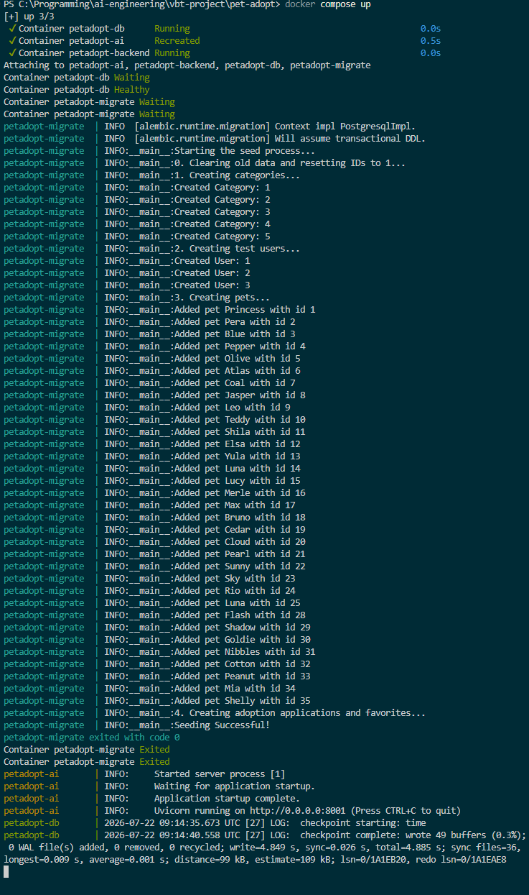
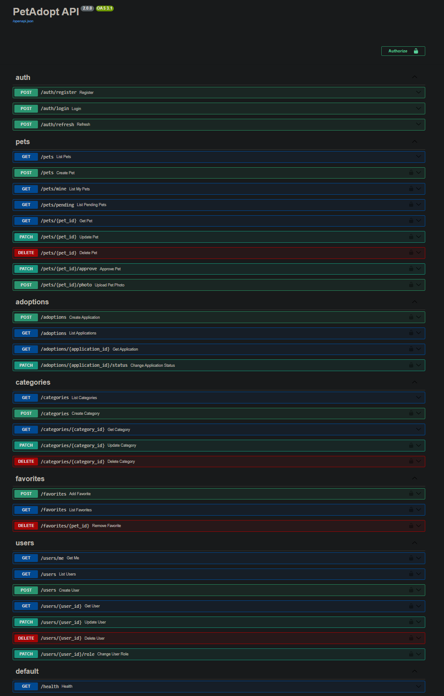
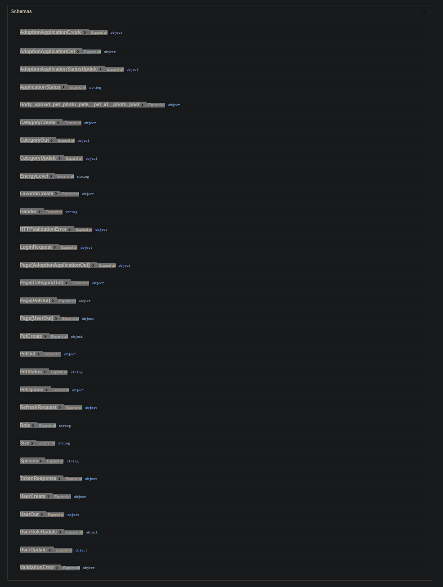
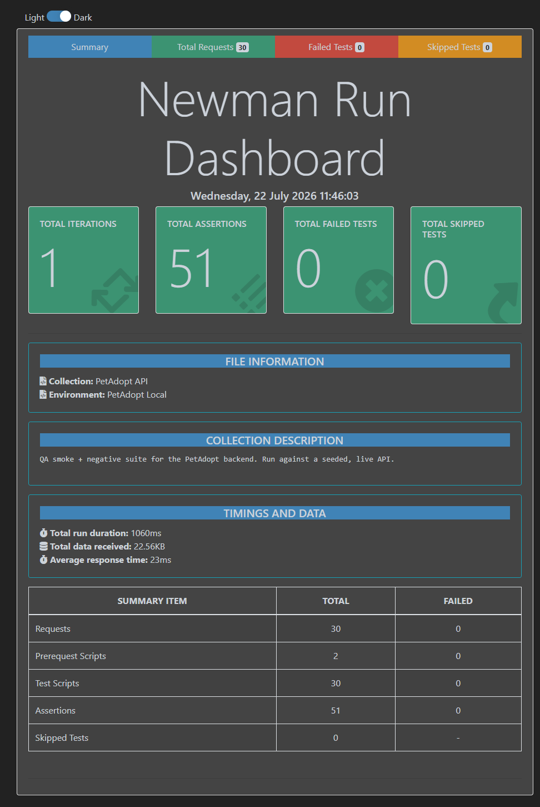

# PetAdopt

VBT Internship 2026 project. A pet adoption platform built as a modern take
on the Swagger Petstore API: a FastAPI backend, a separate Claude-powered AI
service, and a Flutter client.

The original Petstore domain was a shop. We pivoted it to adoption, which
changed the meaning of most of the model: `price` became an optional
`adoption_fee`, orders became adoption applications, and users can post
their own listings for an admin to approve.

## Repository layout

```
backend/            Pet adoption API (FastAPI + PostgreSQL) — see backend/README.md
ai/                 AI service (FastAPI + Claude) — see ai/README.md
frontend/           Flutter client (web and mobile) — see frontend/README.md
qa/                 Postman/Newman API collection and environment
.github/workflows/  CI (pytest on every push and pull request)
docker-compose.yml  Full stack: postgres + migrate + backend + ai
```

The two Python services are deliberately separate: the AI service can be
restarted, rate-limited or taken down without affecting the main API. They
share the database but not their models — the AI service reads the database
directly, read-only.

## Tech stack

| Area | Choice |
|---|---|
| API | FastAPI, Pydantic v2 |
| Database | PostgreSQL 16, SQLAlchemy 2, Alembic |
| Auth | JWT (access + refresh), bcrypt hashing, role-based access (`user` / `admin`) |
| AI | Anthropic Claude, versioned prompt modules, tenacity retries |
| Client | Flutter, Dio, Riverpod-style providers, go_router |
| Errors | RFC 7807 Problem Details (`application/problem+json`) |
| QA / CI | pytest (isolated SQLite + mocked LLM), Postman/Newman, GitHub Actions |

## Getting started

### Quick start — full stack in one command

Requires Docker Desktop. From the repository root, create a `.env` from the
example and fill in the two secrets:

```bash
cp .env.example .env
# ANTHROPIC_API_KEY=sk-ant-...
# SECRET_KEY=<generate with: python -c "import secrets; print(secrets.token_hex(32))">
```

Then bring the whole stack up:

```bash
docker compose up --build
```

This starts PostgreSQL, runs a one-shot `migrate` service (`alembic upgrade
head` then `python seed.py`), and — only after migration and seed succeed —
starts the backend and the AI service:

- Backend API: http://localhost:8000  (docs at `/docs`)
- AI service:  http://localhost:8001  (docs at `/docs`)

`seed.py` truncates the tables before inserting, so every `up` gives you the
same known dataset.

### Running the services individually (for development)

Bring up only the database with `docker compose up -d db`, then run each
service from its own folder against `localhost:5432`. Each service reads its
own `.env` (see the `.env.example` files):

```bash
cd backend
pip install -r requirements.txt
python -m alembic upgrade head
python seed.py
python -m uvicorn app.main:app --reload --port 8000
```

```bash
cd ai
pip install -r requirements.txt
python -m uvicorn app.main:app --reload --port 8001
```

### Flutter client

```bash
cd frontend
flutter pub get
flutter run -d chrome
```

## Authentication and scope

Auth is intentionally scoped to **register, login, refresh, and admin
protection** — no email verification, password reset or OAuth.

- `POST /auth/register` creates a `user`; the first admins come from the seed.
- `POST /auth/login` returns a short-lived **access token** (15 min) and a
  longer-lived **refresh token** (7 days).
- `POST /auth/refresh` exchanges a valid refresh token for a new access token.
- Protected routes depend on the current user; admin-only routes depend on a
  `require_admin` guard.

The refresh token is **stateless** but carries a `jti` (token id), so a
revocation list can be added later without changing the token format. The
user's **role is read from the database on every request**, not trusted from
the token — a demoted admin loses access immediately.

## Permission matrix

| Resource | Public (no token) | Authenticated user | Admin only |
|---|---|---|---|
| Auth | register, login, refresh | — | — |
| Pets | list, get (approved only) | create, update/delete own, `/mine`, add photo | `/pending`, approve |
| Categories | list, get | — | create, update, delete |
| Adoptions | — | apply, list/get own | change status |
| Users | — | `/me` | list, get, create, update, change role, delete |
| Favorites | — | add, list, remove | — |

A record the caller is not allowed to **see** returns `404` (so its
existence is not leaked); a record they may see but not **act on** returns
`403`.

## AI service endpoints

| Endpoint | Purpose |
|---|---|
| `POST /generate-description` | Writes an adoption listing from a pet's attributes |
| `POST /recommend-pet` | Picks the best match for a free-text description of the adopter's lifestyle |
| `POST /classify-image` | Identifies species and guesses breed from a photo |
| `POST /assistant` | Single chat entry point; routes intent internally to the functions above |

`/assistant` is stateless: the client sends the full `messages` history
(text plus an optional image) on every request; nothing is stored
server-side. Recommendations always return a **real pet with its real
`photo_url`** — no generated images.

`/recommend-pet` reads pets directly from the database and only considers
listings that are `available` **and** approved, so unapproved user listings
never surface in recommendations. This is the same public-visibility rule
the backend enforces on `/pets` — it deliberately lives in **both services**.

Prompts live in `ai/app/prompts/` as versioned modules (`description_v1`,
`recommend_v1`, `classify_v1`, `assistant_v1`, `router_v1`). Each exports a
`PROMPT_VERSION`, so a response can always be traced to the prompt that
produced it. Ages below one year are rendered as "approximately N months" in
code before the prompt is built, because "0.5 years old" reads badly and
models echo it back.

## Design decisions

- **Custom retry, not the SDK default.** The AI client retries only transient
  errors (429 / 5xx / network) with exponential backoff, and never retries
  4xx like 400/401. Retry counts and delays are configurable via settings.
- **Role from the database, not the token.** Authorization reads the live
  role on each request, so revoking admin takes effect immediately.
- **Invisible record → 404, unauthorized action → 403.** Hiding existence
  from callers who shouldn't know a record exists; distinguishing that from a
  genuine permission error.
- **Stateless refresh token with a `jti`.** No server-side session store now,
  but ready for revocation later without a format change.
- **The AI service reads the database directly, read-only.** It never calls
  the backend API, and shares the database without sharing models.
- **`per_page`, not `size`.** The old pagination name `size` clashed with the
  pet `size` filter, so pagination uses `page` / `per_page`.
- **`age` and `adoption_fee` are serialized as strings.** They are
  `Decimal` in the database; serializing as strings preserves precision that
  a float round-trip would lose.
- **Adoption pivot.** Orders became adoption applications; an approved
  application moves the pet to `pending`, a completed one to `adopted`, and a
  rejected one leaves it `available`.

## Data model

Five tables: `pet`, `category`, `user`, `adoption_application`, `favorites`.

The field list is frozen in the data contract issue and is the single source
of truth. Models, Pydantic schemas and Flutter types all follow it, and
**any change to it must be discussed in that issue before implementation** —
the three layers break independently otherwise.

Details worth knowing without reading the contract:

- `pet.age` is `decimal(3,1)`, not an integer, so young animals can be
  represented (`0.5` = about six months).
- `pet.owner_id` and `pet.is_approved` support user-submitted listings. A
  listing from a regular user starts unapproved and is invisible to the
  public until an admin approves it.
- Defaults for `role`, `status` and `is_approved` are database defaults, so a
  raw SQL insert succeeds without supplying them.
- `favorites` uses a composite primary key, so the same user cannot favourite
  the same pet twice.
- Password hashing lives in the service layer (`app/core/security.py`).
  Models store `password_hash` and nothing more.

## Seed data

`backend/seed.py` builds a realistic dataset: 35 pets across all five species
with varied size and energy levels, 5 categories, 2 admins and 1 regular
user, adoption applications covering all four statuses, and a few favourites.
A handful of pets are `adopted` or `pending`, and a few are unapproved user
listings, so every filter and permission path has something to exercise.

Seed logins (local development only):

| Role | Email | Password |
|---|---|---|
| admin | bilge@hotmail.com | Bilge1234 |
| admin | arjin@outlook.com | Arjin2026 |
| user | seda@gmail.com | Sedanur2002 |

## Testing

### Unit and integration tests (pytest)

Both suites run without a real database or API key — the backend uses an
in-memory SQLite fixture and the AI service mocks every LLM call, which is
what keeps CI simple and fast.

```bash
cd backend && pytest -q      # SECRET_KEY must be set in the environment or backend/.env
cd ai && pytest -q           # ANTHROPIC_API_KEY / DATABASE_URL can be any dummy value
```

### API collection (Newman)

`qa/` holds a Postman collection that runs against a live, seeded API
(bring the stack up first). It logs in, captures tokens into the environment,
exercises the full CRUD and adoption flow, and has a negative folder covering
401 / 403 / 404 / 409 / 422.

```bash
npm install -g newman newman-reporter-htmlextra
newman run qa/petadopt.postman_collection.json \
  -e qa/petadopt.postman_environment.json \
  -r cli,htmlextra --reporter-htmlextra-export qa/report.html
```

### CI

`.github/workflows/ci.yml` runs both pytest suites on every push to `main`
and every pull request, as two parallel jobs. Green is required.

## Screenshots

| | |
|---|---|
| Full stack up |  |
| API docs — endpoints |  |
| API docs — schemas |  |
| Newman report |  |

## Conventions

- Work happens on a branch per issue, named `feature/issue-NN-slug` or
  `fix/issue-NN-slug`. Nothing is committed directly to `main`.
- Pull requests reference their issue with `Closes #NN`.
- Commit messages follow Conventional Commits (`feat:`, `fix:`, `refactor:`,
  `chore:`, `build:`, `ci:`, `test:`, `docs:`).
- `.env` files are gitignored and must never be committed. The credentials in
  this README are for local development only.

## Team

| Area | Owner |
|---|---|
| Data layer — models, migrations, seed | Seda |
| Service layer, AI service | Bilge |
| Flutter client | Arjin, Seda |
