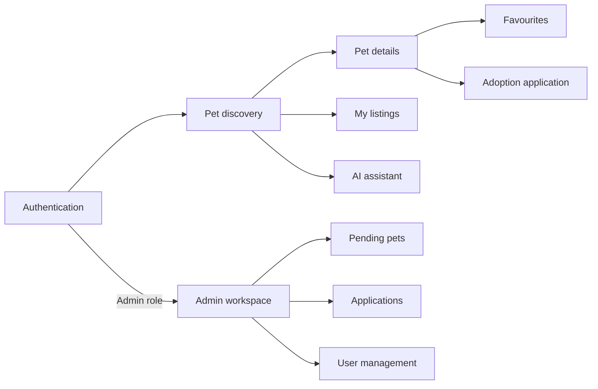
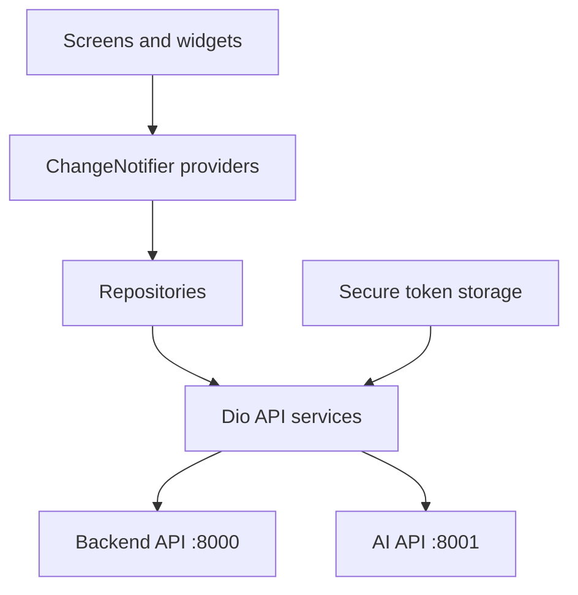
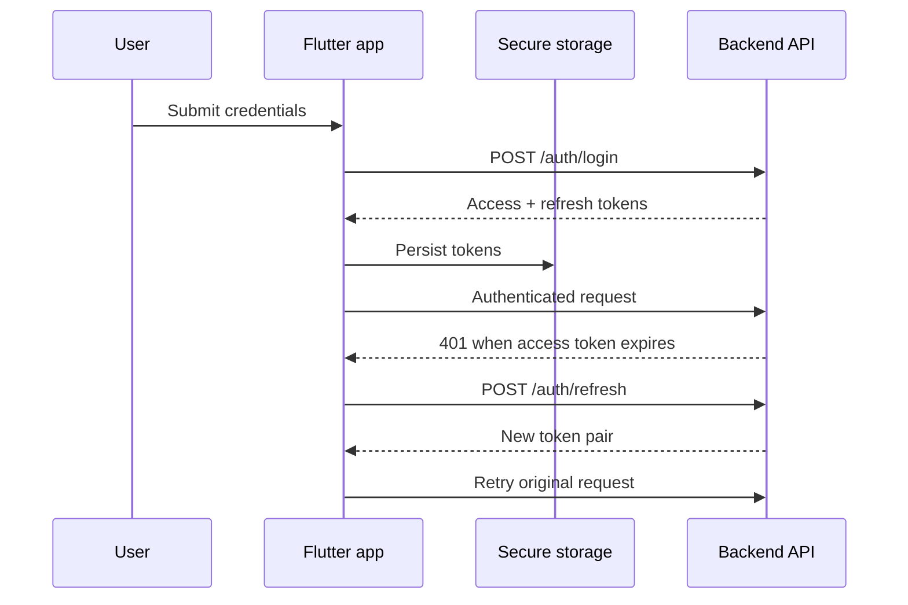

# PetAdopt Frontend

The responsive PetAdopt client built with Flutter. One codebase provides the
pet browsing, adoption, account, AI assistant, and admin experiences across
web, mobile, and desktop.

[](https://flutter.dev/)
[](https://dart.dev/)
[](https://docs.flutter.dev/testing)

## Experience overview



The interface adapts its navigation and content density to mobile, tablet, and
desktop layouts. Authenticated users receive the adoption experience, while
admins can access a dedicated management workspace.

## Features

| Area | Capabilities |
|---|---|
| Authentication | Login, persisted tokens, automatic access-token refresh |
| Pet discovery | Browse, search, filter, inspect details |
| Favourites | Add, list, and remove saved pets |
| Listings | View and manage the current user's pet listings |
| Adoptions | Submit applications and track their status |
| AI assistant | Chat, recommendations, descriptions, and image input |
| Profile | Settings and contact pages |
| Admin | Dashboard, pending pet approval, applications, user management |
| Responsive UI | Mobile, tablet, and desktop layouts |

## Architecture



Features live in self-contained folders and generally follow a
screen → provider → repository/service flow. Shared navigation, networking,
storage, theming, and widgets live under `lib/core/`.

## Tech stack

| Area | Choice |
|---|---|
| UI | Flutter, Material |
| Language | Dart 3.12 |
| State | Provider and `ChangeNotifier` |
| Navigation | `go_router` with auth redirects |
| HTTP | Dio |
| Authentication storage | `flutter_secure_storage` |
| Tests | `flutter_test`, provider and repository tests |
| Targets | Web, Android, iOS, Windows, macOS, Linux |

## Getting started

Install a stable Flutter SDK compatible with Dart 3.12, then run the following
commands from this directory:

```bash
flutter doctor
flutter pub get
```

The client expects the main API on port `8000` and the AI service on port
`8001`. Start the stack from the repository root:

```bash
docker compose up --build
```

Run the web application:

```bash
flutter run -d chrome
```

Or choose another connected target:

```bash
flutter devices
flutter run -d <device-id>
```

## API addresses

The development addresses are selected in
`lib/core/network/api_endpoints.dart`.

| Runtime | Backend | AI service |
|---|---|---|
| Web / desktop | `http://127.0.0.1:8000` | `http://127.0.0.1:8001` |
| Android emulator | `http://10.0.2.2:8000` | `http://10.0.2.2:8001` |

For a physical device, replace the loopback address with the development
machine's LAN address and ensure both devices are on the same network.

## Authentication flow



`GoRouter` listens to the authentication provider. Unauthenticated navigation
is redirected to `/login`; an authenticated visit to `/login` is redirected
to the home page.

## Main routes

| Route | Screen |
|---|---|
| `/login` | Authentication |
| `/` | Main pet discovery experience |
| `/favorites` | Saved pets |
| `/my-pet-listings` | Current user's listings |
| `/adoption-applications` | Adoption application history |
| `/settings` | User settings |
| `/contact` | Contact information |

Admin navigation is contained in the admin workspace and is shown only to
authorized users.

## Quality checks

Format and analyze the project:

```bash
dart format --output=none --set-exit-if-changed lib test
flutter analyze
```

Run the full test suite:

```bash
flutter test
```

Run focused suites while developing:

```bash
flutter test test/features/pets
flutter test test/features/admin
flutter test test/navigation
```

The automated coverage includes startup, navigation, pet discovery and detail
widgets, favourites, repositories, providers, and admin management flows.

## Building

Create a production web build:

```bash
flutter build web
```

Platform builds require the matching host toolchain:

```bash
flutter build apk
flutter build windows
flutter build macos
flutter build linux
```

Build artifacts are written beneath `build/` and must not be committed.

## Project structure

```text
lib/
├── core/
│   ├── constants/   Shared application constants
│   ├── network/     Dio clients, interceptors, API addresses
│   ├── router/      Routes and authentication redirects
│   ├── storage/     Secure token persistence
│   ├── theme/       Application theme
│   └── widgets/     Shared UI components
└── features/
    ├── admin/       Dashboard and management workspace
    ├── adoptions/   Application models, state, services, screens
    ├── ai/          Assistant UI and AI API client
    ├── auth/        Authentication state and screens
    ├── pets/        Discovery, details, favourites, repositories
    └── profile/     Listings, settings, and contact
test/
├── features/        Feature widget and provider tests
├── navigation/      Router behaviour
├── providers/       Shared provider tests
└── repositories/    Data-layer tests
```

## Related services

- [Backend service](../backend/README.md)
- [AI service](../ai/README.md)
- [Repository overview](../README.md)
